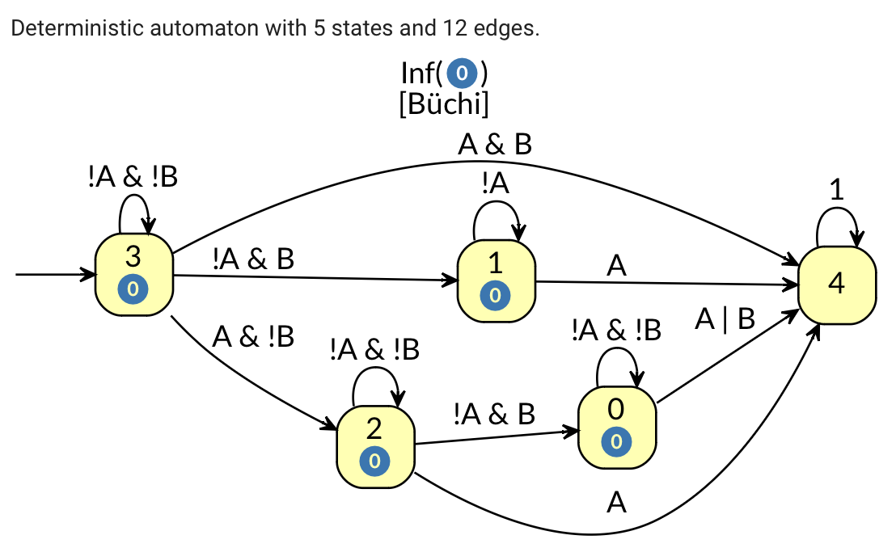
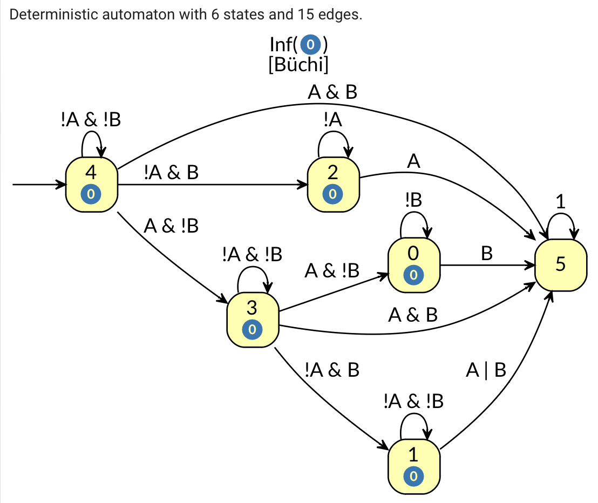
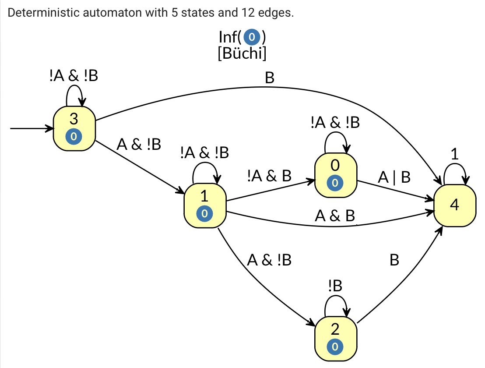

# Texada Templates for Happens Before Invariants (HBIs)

1. (F(A) -> ((!(F(B)) | (!(B) U (A & !(F((A & B)))))) & !(F(!((!(A) | !(X(F(A))))))) & !(F(!((!(B) | !(X(F(B)))))))))

2. (FA & FB) -> (!F!(!A | !XFA) & !F!(!B | !XFB) & (!FB | (!B U (A & !F(A & B)))))

3. (F(B) -> ((!(F(B)) | (!(B) U (A & !(F((A & B)))))) & !(F(!((!(A) | !(X(F(A))))))) & !(F(!((!(B) | !(X(F(B)))))))))

